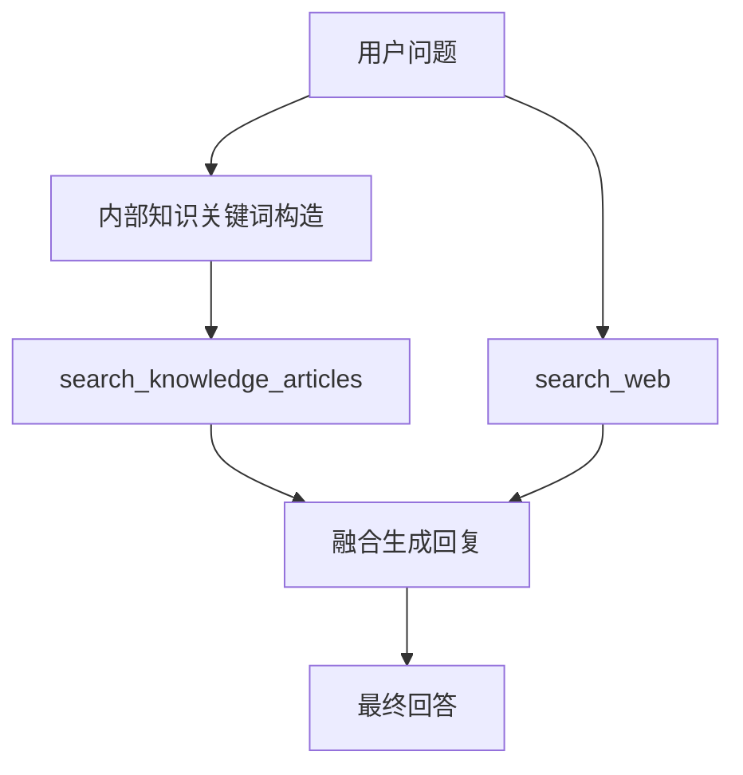

# 变更提案: ai_culture_websearch_context

## 元信息
```yaml
类型: 优化
方案类型: implementation
优先级: P1
状态: 已确认
创建: 2026-04-15
```

---

## 1. 需求

### 背景
当前 AI 对话在遇到“最新外部专业知识”类问题时，已经可以触发联网搜索，但回答主要依赖外部搜索摘要，缺少对企业文化、服务理念、内部 SOP 和标准话术的优先约束。用户希望回答先对齐企业内部标准，再补充外部最新信息。

### 目标
- 对话提示词明确“内部标准优先、外部专业知识补充”的回答规则。
- 强制联网搜索分支在生成最终回复前，先检索内部知识文章，融合企业文化/服务标准，再结合外部搜索结果输出。
- 保持当前 DashScope 联网搜索链路可用，并继续约束无结构化来源时的表述。

### 约束条件
```yaml
时间约束: 当前回合内完成代码、测试和真实接口回归
性能约束: 不引入新的外部依赖，不显著增加对话延迟
兼容性约束: 保持现有 search_web 和 search_knowledge_articles 工具能力不变
业务约束: 回答口径需先对齐企业文化/内部标准，再补充外部最新专业知识
```

### 验收标准
- [ ] 对话提示词和消息增强明确要求先结合企业文化/服务理念/内部SOP再联网搜索
- [ ] 强制联网搜索分支会在最终回复中融合内部知识文章摘要和外部搜索摘要
- [ ] 流式接口真实测试通过，且返回内容体现“内部标准优先、外部补充”

---

## 2. 方案

### 技术方案
在提示词层和服务层同时收口：
1. 在 `TrainAiChatPromptHelper` 中强化系统提示词与用户消息增强，明确“企业文化、服务理念、品牌标准、标准话术、内部 SOP”优先。
2. 在 `TrainAiServiceImpl` 的强制联网搜索分支中，增加内部知识上下文检索：基于用户问题构造企业知识关键词，调用内部知识文章检索并去重。
3. 当内部知识存在时，不直接返回联网搜索摘要，而是再次调用 DashScope 进行一次“内部知识 + 外部搜索摘要”的融合生成；当无内部知识时回退到原有联网搜索回复逻辑。
4. 继续沿用无结构化来源时的严格清洗规则，避免伪造来源。

### 影响范围
```yaml
涉及模块:
  - ruoyi-system train AI 对话模块: 提示词、强制联网搜索分支、回答融合逻辑
  - ruoyi-system AI 单测: 提示词与内部知识关键词构造测试
预计变更文件: 4
```

### 风险评估
| 风险 | 等级 | 应对 |
|------|------|------|
| 内部知识命中不足导致仍退回外部摘要 | 中 | 设计回退逻辑，内部知识为空时沿用现有联网搜索回复 |
| 融合后的回答再次出现伪来源表述 | 中 | 保留无来源清洗和免责声明逻辑，并做真实回归验证 |
| 新增一次非流式融合调用带来少量延迟 | 低 | 仅在强制联网搜索且命中内部知识时触发 |

---

## 3. 技术设计（可选）

### 架构设计


---

## 4. 核心场景

> 执行完成后同步到对应模块文档

### 场景: 企业文化优先的外部知识回答
**模块**: ruoyi-system train AI 对话模块
**条件**: 用户问题同时涉及酒店服务运营场景和最新外部专业知识
**行为**: 先检索企业文化/服务理念/内部SOP/标准话术相关知识，再联网搜索外部专业知识并统一生成回复
**结果**: 回答先体现内部标准，再说明外部最新变化和落地建议

---

## 5. 技术决策

> 本方案涉及的技术决策，归档后成为决策的唯一完整记录

### ai_culture_websearch_context#D001: 强制联网搜索场景采用二次融合生成
**日期**: 2026-04-15
**状态**: ✅采纳
**背景**: 单纯依赖提示词无法保证联网搜索回答稳定体现企业文化和内部标准，需要在服务层显式引入内部知识上下文。
**选项分析**:
| 选项 | 优点 | 缺点 |
|------|------|------|
| A: 只调整提示词 | 改动小 | 无法保证强制联网搜索分支稳定融合内部知识 |
| B: 服务层先取内部知识再二次生成 | 融合效果稳定，可控性强 | 会多一次模型调用 |
**决策**: 选择方案B
**理由**: 用户要求的是实际回答效果，而不是仅靠提示词暗示；服务层显式拼接内部知识和外部搜索摘要更可靠。
**影响**: 对 `TrainAiChatPromptHelper`、`TrainAiServiceImpl` 及对应测试有直接影响
