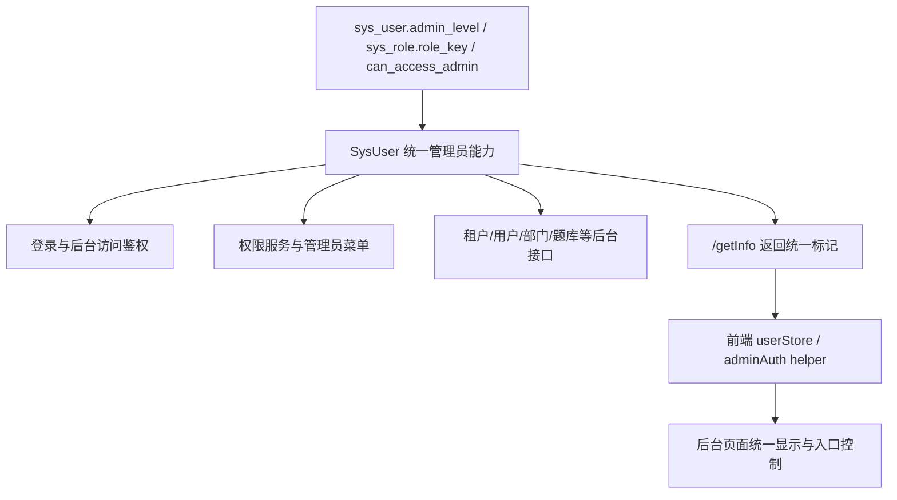

# 变更提案: admin_authority_unify

## 元信息
```yaml
类型: 修复/重构
方案类型: implementation
优先级: P0
状态: 执行中
创建: 2026-03-20
```

---

## 1. 需求

### 背景
- 当前项目同时存在 `adminLevel`、管理员角色 `roleKey`、`canAccessAdmin`、`userId == 1`、`tenantId == '000000'` 等多套管理员判定口径。
- 后端登录、菜单、数据权限、租户隔离和前端页面显示使用的口径不一致，导致平台管理员、租户管理员和普通后台账号在不同页面出现识别错乱。
- 用户已明确要求支持“多个管理员角色并存，最终按最高权限覆盖”，并要求平台管理员不受所在租户限制，拥有全租户管理能力。

### 目标
- 建立统一的管理员权限模型，以“最高管理员级别”作为单一事实来源。
- 统一“后台访问资格”“全租户资格”“高阶管理员权限”三类语义，避免不同模块各自猜测。
- 修复后台关键管理员功能中的错误判定，至少覆盖登录、菜单、用户/角色/租户/部门、租户定制化、题库权限等关键链路。

### 约束条件
```yaml
时间约束: 本轮直接落地，不拆分为仅分析
性能约束: 仅限权限判断与显示口径调整，不引入额外重型查询
兼容性约束: 兼容现有 admin_level/roleKey/can_access_admin 历史数据，不要求立即清库
业务约束:
  - 超级管理员和平台管理员可管理全部租户
  - 平台管理员无论落在哪个 tenant_id 下，都必须具备平台级全局能力
  - 多个管理员角色并存时，按最高权限覆盖低权限
```

### 验收标准
- [x] 后端存在统一的管理员最高级别与能力判断入口，不再散落依赖 `userId == 1` 或单点角色猜测。
- [x] 平台管理员通过 `adminLevel=1` 或 `platform` 角色均能被识别为全租户管理员。
- [x] 后台访问资格与全租户资格语义分离，`canAccessAdmin` 不再等同于“可看全部租户”。
- [x] 前端关键管理员页面统一改为消费后端返回的明确标志，不再自行拼凑判断。
- [x] 后端 `package` 与后台前端 `build:prod` 通过。

---

## 2. 方案

### 技术方案
- 在 `SysUser` 中建立统一的管理员能力判定：
  - 通过 `adminLevel` 与管理员角色映射共同计算“最高管理员级别”
  - 提供 `hasAdminAccess()`、`canManageAllTenants()` 等统一能力方法
- 后端关键链路统一改为依赖上述能力方法：
  - 登录与后台拦截
  - 权限服务与管理员菜单
  - 用户/角色/租户/部门等核心管理接口
  - 训练相关后台统计与权限查询接口
- `/getInfo` 明确返回前端所需的管理员布尔标记与最终级别，前端通过统一 helper 消费。
- 替换后台页面中高风险的权限猜测逻辑，优先覆盖：路由守卫、管理员菜单入口、租户/部门/定制化/公告/会员/题库权限等页面。

### 影响范围
```yaml
涉及模块:
  - ruoyi-common: 统一管理员模型和能力方法
  - ruoyi-framework: 登录鉴权、权限判断、后台访问拦截
  - ruoyi-system: 用户/角色/菜单/部门/租户等服务的权限链路
  - ruoyi-admin: 关键后台控制器的管理员/租户判定
  - RuoYi-Vue3: 用户状态、路由守卫和关键管理员页面显示逻辑
预计变更文件: 15-25
```

### 风险评估
| 风险 | 等级 | 应对 |
|------|------|------|
| 历史账号仅有 `can_access_admin=1` 无明确管理员角色 | 高 | 保留后台访问能力，但不将其误判为全租户管理员 |
| 平台管理员当前分布在业务租户下 | 高 | 统一改为按能力判定，不再受 `tenant_id` 限制 |
| 前后端同时存在旧口径缓存 | 中 | 同步修改 `/getInfo` 与前端 store，并要求重新登录验证 |
| 零散页面仍残留旧判断 | 中 | 通过全文搜索高风险模式并批量替换 |

---

## 3. 技术设计（可选）

> 涉及架构变更、API设计、数据模型变更时填写

### 架构设计


### API设计
#### `GET /getInfo`
- **请求**: 当前登录态
- **响应**:
  - `isSuperAdmin`
  - `isPlatformAdmin`
  - `hasAdminAccess`
  - `canManageAllTenants`
  - `effectiveAdminLevel`

### 数据模型
| 字段 | 类型 | 说明 |
|------|------|------|
| `adminLevel` | `Integer` | 显式管理员级别 |
| `roles[].roleKey` | `String` | 角色派生的管理员级别来源 |
| `canAccessAdmin` | `Boolean` | 后台访问资格，不等同于全租户资格 |
| `effectiveAdminLevel` | `Integer` | 最终生效的最高管理员级别 |

---

## 4. 核心场景

> 执行完成后同步到对应模块文档

### 场景: 平台管理员跨租户管理
**模块**: 登录、权限服务、后台页面
**条件**: 用户具备 `adminLevel=1` 或角色 `platform`
**行为**: 登录后台并访问租户、部门、题库权限等管理页面
**结果**: 用户被识别为平台管理员，拥有全租户可见与操作资格

### 场景: 低级管理员进入后台
**模块**: 登录、后台路由、管理员菜单
**条件**: 用户具备 `tenant_admin/company_admin/dept_admin` 或历史 `canAccessAdmin`
**行为**: 登录后台并访问管理页面
**结果**: 用户可进入后台，但不会被误判为全租户管理员

### 场景: 多管理员角色并存
**模块**: `SysUser` 统一能力模型
**条件**: 用户同时具备多个管理员角色
**行为**: 系统计算最高管理员级别
**结果**: 以最高权限覆盖低权限，所有关键链路判定一致

---

## 5. 技术决策

> 本方案涉及的技术决策，归档后成为决策的唯一完整记录

### admin_authority_unify#D001: 以统一管理员能力模型替代散落判定
**日期**: 2026-03-20
**状态**: ✅采纳
**背景**: 当前项目同一类管理员能力在不同模块中被 `adminLevel`、角色、`canAccessAdmin`、`userId == 1` 等不同条件表达，导致逻辑漂移。
**选项分析**:
| 选项 | 优点 | 缺点 |
|------|------|------|
| A: 继续按模块修补旧判断 | 改动小、局部见效快 | 会继续出现口径漂移，长期不可维护 |
| B: 在 `SysUser` 收敛管理员能力，再批量替换使用方 | 语义统一、可复用、便于前后端对齐 | 需要同步修改多处链路 |
**决策**: 选择方案B
**理由**: 用户明确要求“高权限覆盖低权限”和“平台管理员全局生效”，只有统一能力模型才能稳定支撑这一口径。
**影响**: 影响登录、权限服务、管理员菜单、后台关键页面和多租户管理行为
